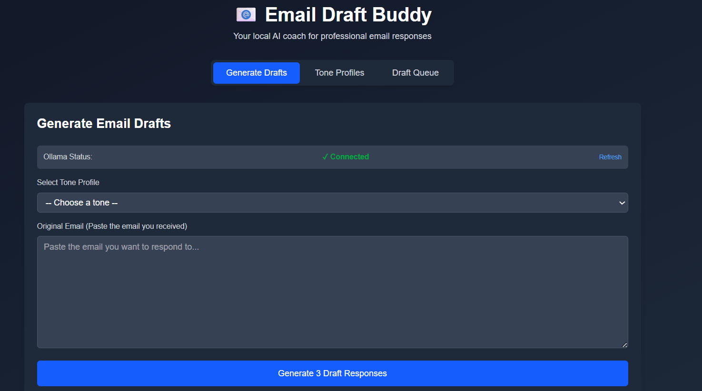
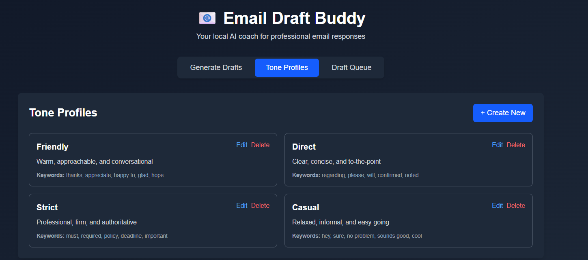
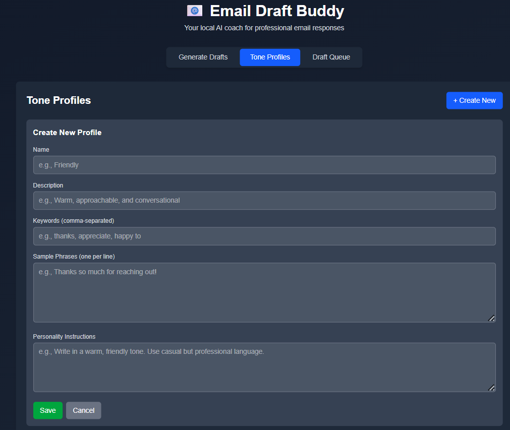
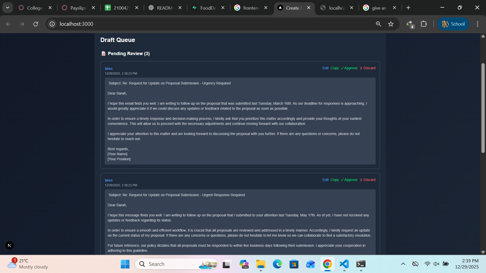

# 📧 Email Draft Buddy

<div align="center">



**Your Local AI Coach for Professional Email Responses**

[](https://nextjs.org/)
[](https://www.typescriptlang.org/)
[](https://ollama.ai/)
[](LICENSE)

[Features](#-features) • [Demo](#-screenshots) • [Installation](#-installation) • [Usage](#-usage) • [Tech Stack](#-tech-stack)

</div>

---

## 📖 About

**Email Draft Buddy** is a privacy-first desktop/web application that helps users respond to emails professionally using AI-powered draft generation with customizable tone profiles. Unlike AI chatbots that replace the user, Email Draft Buddy acts as a **draft coach** - providing 3 variations of professional responses while keeping you in full control.

### Why Email Draft Buddy?

| Problem | Solution |
|---------|----------|
| Don't know how to start replies | Generates ready-to-edit drafts instantly |
| Sound too rude or too soft | Tone profiles ensure consistent communication |
| AI chatbots feel too automated | Acts as a coach, not an autopilot |
| Privacy concerns with online AI | Runs 100% locally - your inbox stays private |

**Perfect for:**
- 🎓 Students emailing teachers/supervisors
- 💼 Small business owners handling customer emails
- 🌍 Non-native English speakers
- ⚡ Busy professionals & freelancers

---

## ✨ Features

### 🎨 **Tone Profile Management**
- **4 Pre-built Profiles**: Friendly, Direct, Strict, Casual
- **Full CRUD Operations**: Create, edit, delete custom tone profiles
- **Customizable Parameters**: Keywords, sample phrases, personality instructions

### 🤖 **AI-Powered Draft Generation**
- **3 Variations Per Email**: Different styles/lengths based on same tone
- **Real-time Progress Tracking**: 5-stage visual indicator with elapsed time
- **Local Processing**: 100% offline using Ollama + Mistral/LLaMA 3.1
- **Smart Timeout Handling**: Auto-detects slow systems with helpful suggestions

### 📝 **Draft Review Queue**
- **Status Management**: Pending, Approved, Discarded
- **Inline Editing**: Modify drafts before approval
- **One-Click Actions**: Copy to clipboard, approve, discard
- **Persistent Storage**: LocalStorage for offline capability

### 🔐 **Privacy First**
- ✅ 100% Local Processing
- ✅ No Cloud Storage
- ✅ No External APIs
- ✅ Complete User Control

---

## 📸 Screenshots

### Generate Email Drafts

*Paste an email, select tone, and generate 3 professional draft responses with real-time progress tracking*

### Tone Profiles

*Manage pre-built and custom tone profiles with keywords and sample phrases*

### Create Custom Tone

*Create your own tone profiles tailored to your communication style*

### Draft Queue

*Review, edit, approve, or discard generated drafts before sending*

---

## 🛠️ Tech Stack

| Category | Technology |
|----------|-----------|
| **Frontend** | Next.js 14 (App Router) |
| **Language** | TypeScript |
| **Styling** | Tailwind CSS |
| **AI Model** | Ollama (Mistral / LLaMA 3.1) |
| **Storage** | Browser LocalStorage |
| **State Management** | React Hooks |

---

## 🚀 Installation

### Prerequisites

- **Node.js** 18+ ([Download](https://nodejs.org/))
- **npm** or **yarn**
- **Ollama** ([Download](https://ollama.ai/download))

### Step 1: Install Ollama

#### Windows
1. Download from [ollama.ai/download](https://ollama.ai/download)
2. Run the installer
3. Verify: `ollama --version`

#### Mac/Linux
```bash
curl -fsSL https://ollama.ai/install.sh | sh
```

### Step 2: Pull AI Model

```bash
# Recommended: Mistral (faster)
ollama pull mistral

# Alternative: LLaMA 3.1 (more detailed)
ollama pull llama3.1
```

### Step 3: Clone & Install

```bash
# Clone the repository
git clone https://github.com/yourusername/email-draft-buddy.git
cd email-draft-buddy

# Install dependencies
npm install

# Start development server
npm run dev
```

### Step 4: Start Ollama Server

In a separate terminal:
```bash
ollama serve
```

Keep this terminal running in the background.

---

## 💻 Usage

### 1. Start the App

```bash
npm run dev
```

Open [http://localhost:3000](http://localhost:3000) in your browser.

### 2. Generate Drafts

1. **Go to "Generate Drafts" tab**
2. **Check Ollama Status** - should show "✓ Connected"
3. **Select a tone profile** (e.g., "Friendly")
4. **Paste the email** you want to respond to
5. **Click "Generate 3 Draft Responses"**
6. **Wait 1-5 minutes** (depends on system specs)
7. **Review the 3 generated drafts**

### 3. Review & Approve

1. **Go to "Draft Queue" tab**
2. **See all generated drafts** in "Pending Review"
3. **Edit drafts** inline if needed
4. **Approve** your favorite draft
5. **Copy to clipboard** and paste into your email client

### 4. Customize Tones

1. **Go to "Tone Profiles" tab**
2. **Click "+ Create New"**
3. **Fill in**:
   - Name (e.g., "Apologetic")
   - Description
   - Keywords
   - Sample phrases
   - Personality instructions
4. **Save** and use in draft generation

---

## 📁 Project Structure

```
email-draft-buddy/
├── app/
│   ├── page.tsx              # Main app with tab navigation
│   ├── layout.tsx            # Root layout with metadata
│   └── globals.css           # Global styles + Tailwind
│
├── components/
│   ├── ToneProfileManager.tsx    # CRUD for tone profiles
│   ├── EmailInput.tsx            # Email input + draft generation
│   └── DraftQueue.tsx            # Review, edit, approve drafts
│
├── lib/
│   ├── ollama.ts             # AI API integration (Ollama)
│   ├── storage.ts            # LocalStorage helpers
│   └── defaultTones.ts       # 4 default tone profiles
│
├── types/
│   └── index.ts              # TypeScript interfaces
│
├── public/
│   └── *.png                 # Screenshots for README
│
├── README.md                 # Project documentation
├── QUICKSTART.md             # Fast setup guide
├── SETUP.md                  # Detailed testing guide
├── PROJECT_SUMMARY.md        # Portfolio overview
└── package.json              # Dependencies
```

---

## ⚙️ Configuration

### Environment Variables

No environment variables needed! Everything runs locally.

### Model Selection

To switch AI models, edit `components/EmailInput.tsx` (line ~133):

```typescript
model: 'mistral',  // or 'llama3.1' or 'phi'
```

### Timeout Settings

Adjust per-draft timeout in `components/EmailInput.tsx` (line ~127):

```typescript
const timeoutId = setTimeout(() => controller.abort(), 240000); // 4 minutes
```

---

## 🐛 Troubleshooting

### Issue: "Ollama Status: ✗ Not Connected"

**Solution:**
1. Check if Ollama is running: `curl http://localhost:11434/api/tags`
2. If error, restart: `ollama serve`
3. Click "Refresh" in the app

### Issue: "Draft generation timed out"

**Causes:**
- Low system specs (office laptop)
- Large email text
- First generation (model loading)

**Solutions:**
- Use shorter email text
- Switch to faster model (Mistral → Phi)
- Increase timeout in code
- Wait for first generation (subsequent ones are faster)

### Issue: Generation takes 5+ minutes

**For Low-Spec Systems:**
1. Use **Phi model** (fastest):
   ```bash
   ollama pull phi
   ```
2. Change model in `EmailInput.tsx` to `'phi'`
3. Use **shorter emails** (< 50 words)

---

## 🗺️ Roadmap

### Phase 2 (Easy Wins)
- [ ] Dark mode toggle
- [ ] Export drafts to .txt file
- [ ] Keyboard shortcuts (Ctrl+G, Ctrl+A)
- [ ] Draft word count

### Phase 3 (Medium)
- [ ] Draft rating system (👍/👎 for learning)
- [ ] Email sentiment analysis
- [ ] Side-by-side draft comparison
- [ ] Search/filter drafts

### Phase 4 (Advanced)
- [ ] PWA support (offline web app)
- [ ] Electron wrapper (desktop app)
- [ ] Fine-tuning on user's approved drafts
- [ ] Email client integration (Gmail/Outlook)

---

## 🤝 Contributing

Contributions are welcome! Here's how you can help:

1. **Fork the repository**
2. **Create a feature branch**: `git checkout -b feature/amazing-feature`
3. **Commit your changes**: `git commit -m 'Add amazing feature'`
4. **Push to branch**: `git push origin feature/amazing-feature`
5. **Open a Pull Request**

### Development Guidelines

- Use TypeScript for type safety
- Follow existing code style (Prettier/ESLint)
- Test on both light and dark modes
- Update documentation for new features

---

## 📝 License

This project is licensed under the **MIT License** - see the [LICENSE](LICENSE) file for details.

**TL;DR**: You can use, modify, and distribute this project freely, even commercially. Just include the original license.

---

## 🏆 Why This Project Stands Out

### For Portfolio
- ✅ Solves a **real problem** (email communication is universal)
- ✅ **Technical depth** (AI integration, modern React, TypeScript)
- ✅ **Privacy angle** (differentiates from cloud-based solutions)
- ✅ **Complete MVP** (fully functional, not just a prototype)
- ✅ **Extensible** (clear roadmap for enhancements)

### For Employers
- Shows **full-stack thinking** (even though frontend-heavy)
- Demonstrates **product sense** (problem-solution fit)
- Proves **technical breadth** (AI, frontend, storage)
- Highlights **attention to detail** (error handling, UX)
- Indicates **modern tech familiarity** (Next.js 14, Ollama)

---

## 👤 Author

**Your Name**

- GitHub: [@yourusername](https://github.com/yourusername)
- LinkedIn: [Your Name](https://linkedin.com/in/yourprofile)
- Portfolio: [yourportfolio.com](https://yourportfolio.com)

---

## 🙏 Acknowledgments

- [Ollama](https://ollama.ai/) - Local AI inference
- [Next.js](https://nextjs.org/) - React framework
- [Tailwind CSS](https://tailwindcss.com/) - Styling
- [Meta AI](https://ai.meta.com/) - LLaMA models
- [Mistral AI](https://mistral.ai/) - Mistral models

---

<div align="center">

**⭐ Star this repo if you found it helpful!**

Made with ❤️ for privacy-conscious email users

</div>

